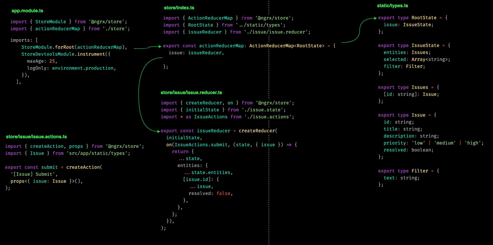

# NgRx

<!-- @import "[TOC]" {cmd="toc" depthFrom=2 depthTo=6 orderedList=false} -->

<!-- code_chunk_output -->

- [Installation](#installation)
  - [`ng add @ngrx/store@latest`](#ng-add-ngrxstorelatest)
    - [`ng add @ngrx/schematics`](#ng-add-ngrxschematics)
      - [`angular.json` added lines](#angularjson-added-lines)
      - [`package.json` added line](#packagejson-added-line)
      - [Both steps above could be performed manually](#both-steps-above-could-be-performed-manually)
  - [Or manually](#or-manually)
    - [Importing StoreModule `app.module.ts`](#importing-storemodule-appmodulets)
- [Simple Store](#simple-store)
  - [First Example: Simple Counter](#first-example-simple-counter)
    - [Overview](#overview)
    - [Types](#types)
    - [Action](#action)
      - [Additional info about `props`](#additional-info-about-props)
    - [Reducers](#reducers)
    - [Action Reducer Mapping](#action-reducer-mapping)
    - [Store Configuration](#store-configuration)
    - [Store DevTools Configuration](#store-devtools-configuration)
    - [Counter Component](#counter-component)
      - [TS](#ts)
      - [Template](#template)
- [Recipes](#recipes)
  - [What Not to Put in the State](#what-not-to-put-in-the-state)
    - [Derived State](#derived-state)
    - [Local State](#local-state)
    - [Classes and Special Objects](#classes-and-special-objects)
      - [Functions](#functions)
      - [Blobs](#blobs)
      - [Date objects](#date-objects)
      - [Promises](#promises)
      - [Observables](#observables)
      - [HTML Elements](#html-elements)
      - [`window`](#window)
      - [Other Non-Serializable Objects](#other-non-serializable-objects)

<!-- /code_chunk_output -->

## Installation

### `ng add @ngrx/store@latest`

```shell
ng add @ngrx/store@latest
```

#### `ng add @ngrx/schematics`

```shell
ng add @ngrx/schematics@latest

  Installing packages for tooling via npm.
  Installed packages for tooling via npm.
  Do you want to use @ngrx/schematics as the default collection? Yes
  UPDATE angular.json (3772 bytes)
```

##### `angular.json` added lines

```diff
+ "cli": {
+    "defaultCollection": "@ngrx/schematics"
+  }
```

##### `package.json` added line

```diff
  "devDependencies": {

+    "@ngrx/schematics": "^11.0.1",

  }
```

##### Both steps above could be performed manually

```shell
npm i @ngrx/schematics -S
ng config cli.defaultCollection @ngrx/schematics
```

### Or manually

```shell
npm i @ngrx/store -S
```

#### Importing StoreModule `app.module.ts`

```diff
import { BrowserModule } from '@angular/platform-browser';
import { NgModule } from '@angular/core';

import { AppRoutingModule } from './app-routing.module';
import { AppComponent } from './app.component';

// EBIA

+ import { StoreModule } from '@ngrx/store';

@NgModule({
   declarations: [AppComponent],
   imports: [
      BrowserModule,
      AppRoutingModule,
+     StoreModule.forRoot({}),
   ],
   providers: [],
   bootstrap: [AppComponent],
})
export class AppModule {}
```

## Simple Store

### First Example: Simple Counter



#### Overview

> I may change some paths afterwards (ongoing documentation). Please do not be confused; principles remain the same!

<!-- prettier-ignore-start -->
| What                   | Where                                |
| ---------------------- | ------------------------------------ |
| **Store Types** |
| types                  | `/static/types.ts`                   |
| **Store Constituents** |
| actions                | `/store/actions.ts`          |
| reducers               | `/store/reducers.ts`         |
| action-reducer-mapping | `/store/actionReducerMap.ts` |
| **Store Configuration** |
| `StoreModule.forRoot(actionReducerMap)` | `app.module.ts` |
| **Store DevTools Configuration** |
| `StoreDevtoolsModule.instrument({..}),` | `app.module.ts` |
| **Counter Component** |
| Component Template | `counter.component.html` |
| Component | `counter.component.ts` |
<!-- prettier-ignore-end -->

#### Types

Type description of the store-state.

```typescript
export interface State {
  count: number;
}
```

#### Action

```ts
import { createAction, props } from '@ngrx/store';

export const increment = createAction('[Counter] Increment');

export const multiply = createAction(
  '[Counter] Multiply',
  props<{ factor: number }>(),
);
```

##### Additional info about `props`

It's TypeDefinition:

```ts
export declare function props<
  P extends object
>(): ActionCreatorProps<P>;

export interface ActionCreatorProps<T> {
  _as: 'props';
  _p: T;
}
```

#### Reducers

```ts
import { createReducer, on } from '@ngrx/store';
import { increment, multiply } from './actions';

export const countReducer = createReducer(
  0,
  on(increment, (count) => count + 1),
  on(multiply, (count, { factor }) => count * factor),
);
```

#### Action Reducer Mapping

```ts
import { ActionReducerMap } from '@ngrx/store';
import { State } from '../static/types';
import { countReducer } from './reducers';

export const actionReducerMap: ActionReducerMap<State> = {
  count: countReducer,
};
```

#### Store Configuration

```ts
// app.module.ts (excerpt)
import { StoreModule } from '@ngrx/store';
import { actionReducerMap } from './store/actionReducerMap';
// @NgModule -> imports
StoreModule.forRoot(actionReducerMap),
```

#### Store DevTools Configuration

Install `@ngrx/store-devtools` and add its schema:

```shell
npm i @ngrx/store-devtools -D
ng add @ngrx/store-devtools@latest
```

Following modification will be made automatically:

```ts
// app.module.ts (excerpt)
import { StoreDevtoolsModule } from '@ngrx/store-devtools';
import { environment } from '../environments/environment';

// @NgModule -> imports
StoreDevtoolsModule.instrument({
  maxAge: 25,
  logOnly: environment.production,
}),
```

#### Counter Component

##### TS

```ts
import { Component, OnInit } from '@angular/core';
import { Store } from '@ngrx/store';
import { Observable } from 'rxjs';
import { increment, multiply } from 'src/app/store/counter/actions';
import { CounterState } from 'src/app/static/types';

@Component({
  selector: 'app-counter',
  templateUrl: './counter.component.html',
  styleUrls: ['./counter.component.scss'],
})
export class CounterComponent implements OnInit {
  count$: Observable<number>;

  constructor(private store: Store<CounterState>) {
    this.count$ = this.store.select((state) => state.count);
  }

  ngOnInit(): void {}

  increment(): void {
    this.store.dispatch(increment());
  }

  multiply(factor: string) {
    this.store.dispatch(multiply({ factor: parseFloat(factor) }));
  }
}
```

##### Template

```html
<p>Counter: {{ count$ | async }}</p>
<button (click)="increment()">Increment</button>

<p>
  <input type="number" value="1" #factorInput />
  <button (click)="multiply(factorInput.value)">Multiply</button>
</p>
```

## Recipes

### What Not to Put in the State

#### Derived State

#### Local State

#### Classes and Special Objects

##### Functions

##### Blobs

##### Date objects

Try `Date.toJson()` or save DateString.

##### Promises

##### Observables

##### HTML Elements

##### `window`

##### Other Non-Serializable Objects
