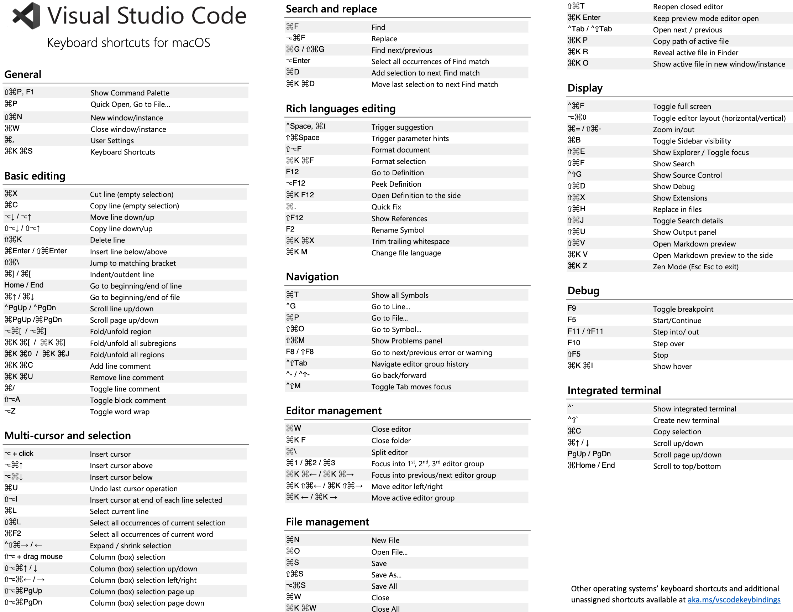

# VSCode

> Status: Under Construction

<!-- @import "[TOC]" {cmd="toc" depthFrom=2 depthTo=5 orderedList=false} -->

<!-- code_chunk_output -->

- [Overview](#overview)
  - [Secondary Bar](#secondary-bar)
- [Quick Open](#quick-open)
- [Editing](#editing)
  - [Side by Side Editing](#side-by-side-editing)
- [Excluding Folders](#excluding-folders)
- [Shortcuts](#shortcuts)
  - [MacOS](#macos)
  - [Windows](#windows)

<!-- /code_chunk_output -->

## Overview


### Secondary Bar

```plaintext
Show: ⌥ ⌘ B
Toggle: ⌘ B
```

## Quick Open

```plaintext
Quick Open: ⌘ P
Quick Open Symbols: ⌘ T
Command Palette: ⇧ ⌘ P
```

## Editing

### Side by Side Editing

```plaintext
Split active Editor:      ⌘ \           Editor
Open to the Side:         ⌥ + Click     File in Explorer
```

### Multi-Cursor Editing

```plaintext
Add Cursor                    ⌥ + Click  
Add Cursor to Next Line:      ⌥ ⌘ ↓
Add Cursor to Previous Line:  ⌥ ⌘ ↑
Add Cursor Above:             ⇧ ⌥ ↑
Add Cursor Below:             ⇧ ⌥ ↓
Add Cursor to Line Ends:      ⇧ ⌘ L
Add Next Occurrence:          ⌘ D
Add All Occurrences:          ⌘ ⇧ L
```

## Excluding Folders

By default, VS Code excludes some folders from the Explorer (for example. `.git`). Use the `files.exclude` [setting](https://code.visualstudio.com/docs/getstarted/settings) to configure rules for hiding files and folders from the Explorer.

**Tip:** This is really useful to hide derived resources files, like `\*.meta` in Unity, or `\*.js` in a TypeScript project. For Unity to exclude the `\*.cs.meta` files, the pattern to choose would be: `"**/*.cs.meta": true`. For TypeScript, you can exclude generated JavaScript for TypeScript files with: `"**/*.js": {"when": "$(basename).ts"}`.

## Shortcuts

### MacOS



### Windows


